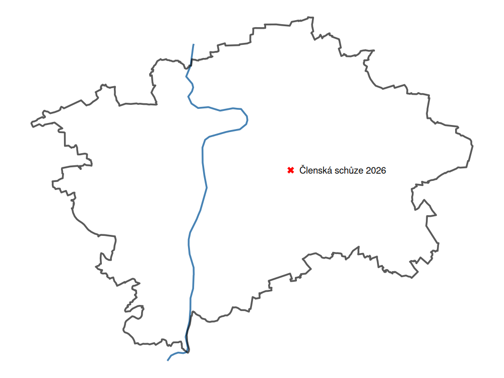

# 🌐 Využití prostorových dat ve statistické praxi, s důrazem na území České republiky

Odborná přednáška na [členské schůzi České statistické společnosti](https://www.statspol.cz/clenska-schuze-2026/) v pátek 6. března 2026

  

Struktura repozitáře:
- `JLA-statspol-prezka.odp` prezentace ve formátu Open Office Impress
- `JLA-statspol-prezka.pdf` prezentace ve formátu Adobe Acrobat Reader
- `/R/1-geocoding.R` získání dat a kreslení map / geocoding + [`{RCzechia}`](https://rczechia.jla-data.net/) package
- `/R/2-vánoční-kapr.R` získání dat a kreslení map / staťák + [`{czso}`](https://petrbouchal.xyz/czso/) package 
- `/R/3-projekce.R` volba mapové projekce a její dopady
- `/R/4-geomarketing.R` geomarketing a získání dat z Open Street Map / [`{osmdata}`](https://docs.ropensci.org/osmdata/) package
- `/R/5-dlouhověkost.R` modelování dlouhověkosti nad historickými censy
- `/R/6-matice-vzdáleností.R` konstrukce a využití vzdálenostní matice
- `/R/7-matice-sousedství.R` konstrukce a využití matic sousedství a vah
- `/R/8-využití-AI.R` extrakce lokalit a souřadnic z textu písně
- `/data` podkladová data pro vzdálenostní matici + lokální cache pro soubory z ČSÚ

Techické upozornění: skripty na pozadí "potichu" využívají API klíče pro služby HERE (modelový příklad geomarketing - výpočet dochozí vzdálenosti) a Google (geocoding a Gemini AI). Tyto služby vyžadují registraci, a bez nastaveného klíče (dělá se v `.Renviron` souboru) nemusí ód vracet očekávaný výsledek.
